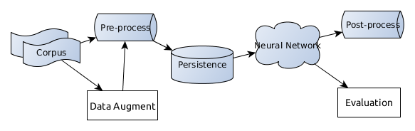

## FlexNER
Here is the project [page](https://liftkkkk.github.io/FLEXNER/).

#### As long as this paper is accepted, this toolkit can be downloaded.

### Requirement

    Python 2  
    Tensorflow: >=1.4  
    
### Usage
```
usage: train_transfer.py [-h] [-a ALGORITHM] [-ag AUGMENT] [-m MODE]
                         [-mp MODEL_PATH] [-g1 GRADIENT_STOP_NET1]
                         [-g2 GRADIENT_STOP_NET2] [-g3 GRADIENT_STOP_NET3]
                         [-g4 GRADIENT_STOP_NET4] [-r1 MASK_NET1]
                         [-r2 MASK_NET2] [-r3 MASK_NET3] [-r4 MASK_NET4]

This list provides the options to control the runing status.

optional arguments:
  -h, --help            show this help message and exit
  -a ALGORITHM, --algorithm ALGORITHM
                        Select an algorithm for the model
  -ag AUGMENT, --augment AUGMENT
                        1:True 0:False
  -m MODE, --mode MODE  Select training model. train, restore, tune
  -mp MODEL_PATH, --model_path MODEL_PATH
                        Select the model path
  -g1 GRADIENT_STOP_NET1, --gradient_stop_net1 GRADIENT_STOP_NET1
                        1:True 0:False
  -g2 GRADIENT_STOP_NET2, --gradient_stop_net2 GRADIENT_STOP_NET2
                        1:True 0:False
  -g3 GRADIENT_STOP_NET3, --gradient_stop_net3 GRADIENT_STOP_NET3
                        1:True 0:False
  -g4 GRADIENT_STOP_NET4, --gradient_stop_net4 GRADIENT_STOP_NET4
                        1:True 0:False
  -r1 MASK_NET1, --mask_net1 MASK_NET1
                        1:True 0:False
  -r2 MASK_NET2, --mask_net2 MASK_NET2
                        1:True 0:False
  -r3 MASK_NET3, --mask_net3 MASK_NET3
                        1:True 0:False
  -r4 MASK_NET4, --mask_net4 MASK_NET4
                        1:True 0:False

```

  For the Baseline model
```
python train.py -a base 
```
For the Joint training
```
python joint.py -a join
```
For the separated training
```
(1) python joint.py -a join -r2 1 [-g2 1]
(2) python joint.py -a join -r1 1 [-g1 1] -mp model_path -m tune
(3) python joint.py -a join -g1 1 -g2 1 -mp model_path -m tune
```
    
### Dataset

+ CoNLL-2003 dataset are listed [here](https://github.com/synalp/NER/tree/master/corpus/CoNLL-2003)  
+ NYT dataset can be [downloaded](https://github.com/shanzhenren/CoType)  

### Addition

3 steps to build a simple NER arch.
```python
class Bi_Stacka(Bi_NER):
    # initialize the constructor
    ...
    
    # defined a arch.
    def mix(self):
        # 1. add the embeddings
        self.base_embed=self.embedding_layer_base()
		
        # 2. define your arch.
        encode1=self.mix_stacka('net1')
        encode2=self.mix_stacka('net2')
        
        # concatenate the vector
         self.encode=tf.concat([encode1,encode2],axis=-1)

        # additional process
    	...
    	
    	# 3. add a crf layer
    	self.crf_layer()
```
### Toolkit Overview

The main modules of our system are listed here. The converter module converts the data into the structured form. Then, if using data augmentation, it will add more instances. The structured data is input into the Pre-process module to vectorize them. Next, the vectors are persisted to the database. Alternatively, the real-time process is also okay, but it will add redundant computation. Then, the Post-processing module converts results into user-friendly form. The evaluation module assesses the result.  
<div align="center">

</div> 


### Updating...

* 2017-Sep-10, Bi_NER v0.1, initial version
* 2018-Apr-05, Bi_NER v0.2, supproting easily customize arch. and attention mechanism
* 2018-Nov-03, Bi_NER v0.3, supporting different languages ( tested on English, German, Spanish, Dutch) and biomedical domain
