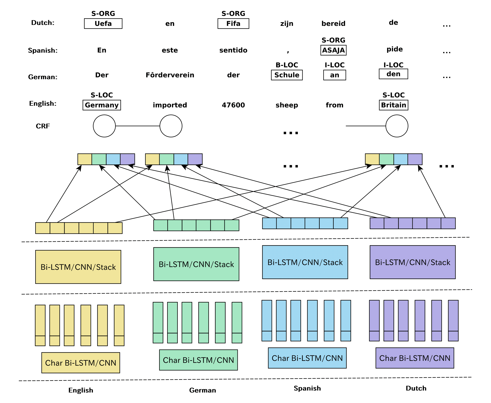
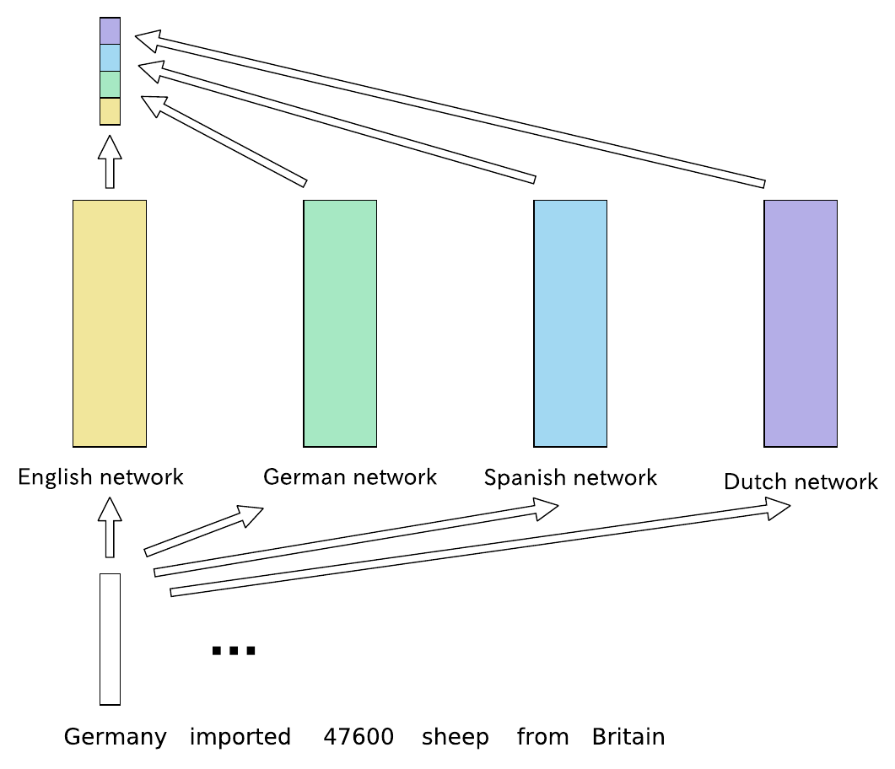
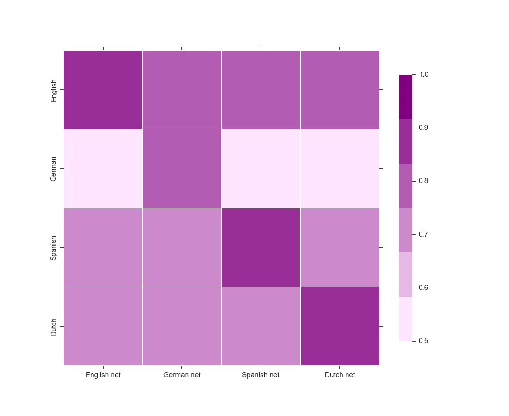

## FlexNER ([Project Tutorial](https://liftkkkk.github.io/FLEXNER/))

+++ updating +++

[](https://opensource.org/licenses/Apache-2.0)


FlexNER is a toolkit of neural NER models designed to accelerate ML research. This version of the tutorial requires TensorFlow >=1.4. It is a preview. The detailed descriptions are still in the making.


### Contents

* [Basics](#basics)
  * [Installation](#installation)
  * [Addition](#addition)
    * [Multi-lateral Network](#multi-lateral-network)
    * [Language Correlation](#language-correlation)
    * [Language Interaction](#language-interaction)
* [Suggested Datasets](#suggested-datasets)
  * [CoNLL-2002](#conll-2002)
  * [CoNLL-2003](#conll-2003)
  * [NYT](#nyt)
  * [IOB,IOB2,BIOES Conversion](#iob,iob2,bioes-conversion)
  * [Using Your Data](#using-your-data)
* [Story of FlexNER](#story-of-flexner)
* [Updating](#updating)

    
## Basics
### Installation
```
usage: run_n1.py [-h] [-a ALGORITHM] [-m MODE] [-mp MODEL_PATH]
                 [--save_model_dir SAVE_MODEL_DIR] [--lang LANG]
                 [--train_h5 TRAIN_H5] [--test_h5 TEST_H5]
                 [--test_pkl TEST_PKL] [--corpus CORPUS]
                 [--results_report RESULTS_REPORT]
                 [--predict_file PREDICT_FILE] [--epoch EPOCH]
                 [--save_step SAVE_STEP] [--use_random_embed USE_RANDOM_EMBED]
                 [--word_embed_h5 WORD_EMBED_H5]
                 [--word_embed_voc WORD_EMBED_VOC] [--char_voc CHAR_VOC]
                 [--build_voc BUILD_VOC] [-g1 GRADIENT_STOP_NET1]
                 [-g2 GRADIENT_STOP_NET2] [-g3 GRADIENT_STOP_NET3]
                 [-g4 GRADIENT_STOP_NET4] [-r1 MASK_NET1] [-r2 MASK_NET2]
                 [-r3 MASK_NET3] [-r4 MASK_NET4]

Main settings

optional arguments:
  -h, --help            show this help message and exit
  -a ALGORITHM, --algorithm ALGORITHM
                        model name
  -m MODE, --mode MODE  restore train tune
  -mp MODEL_PATH, --model_path MODEL_PATH
                        load a model from the path
  --save_model_dir SAVE_MODEL_DIR
                        save a model to the folder
  --lang LANG           language name
  --train_h5 TRAIN_H5   train set h5 file
  --test_h5 TEST_H5     test set h5 file
  --test_pkl TEST_PKL   test set pkl file
  --corpus CORPUS       corpus name
  --results_report RESULTS_REPORT
                        F1 score file
  --predict_file PREDICT_FILE
                        output
  --epoch EPOCH         epoch number
  --save_step SAVE_STEP
                        how many steps to save a model
  --use_random_embed USE_RANDOM_EMBED
                        whether or not to use random embeddings
  --word_embed_h5 WORD_EMBED_H5
                        path fo word embeddings
  --word_embed_voc WORD_EMBED_VOC
                        path of vocab
  --char_voc CHAR_VOC   path of vocab
  --build_voc BUILD_VOC
                        path of build vocab
  -g1 GRADIENT_STOP_NET1, --gradient_stop_net1 GRADIENT_STOP_NET1
                        1:True 0:False
  -g2 GRADIENT_STOP_NET2, --gradient_stop_net2 GRADIENT_STOP_NET2
                        1:True 0:False
  -g3 GRADIENT_STOP_NET3, --gradient_stop_net3 GRADIENT_STOP_NET3
                        1:True 0:False
  -g4 GRADIENT_STOP_NET4, --gradient_stop_net4 GRADIENT_STOP_NET4
                        1:True 0:False
  -r1 MASK_NET1, --mask_net1 MASK_NET1
                        1:True 0:False
  -r2 MASK_NET2, --mask_net2 MASK_NET2
                        1:True 0:False
  -r3 MASK_NET3, --mask_net3 MASK_NET3
                        1:True 0:False
  -r4 MASK_NET4, --mask_net4 MASK_NET4
                        1:True 0:False 

```

  For the Baseline model
```
python train.py -a base 
```
For the Joint training
```
python train.py -a join
```
For the separated training
```
(1) python train.py -a join -r2 1 [-g2 1]
(2) python train.py -a join -r1 1 [-g1 1] -mp model_path -m tune
(3) python train.py -a join -g1 1 -g2 1 -mp model_path -m tune
```

### Addition
#### Multi-lateral Network
3 steps to build a simple multi-lateral NER architecture.
```python
class Bi_Stacka(Bi_NER):
    # initialize the constructor
    ...
    
    # define a arch.
    def mix(self):
        # 1. add the embeddings
        self.base_embed=self.embedding_layer_base()
		
        # 2. define your arch.
        encode1=self.mix_stacka('net1')
        encode2=self.mix_stacka('net2')
        encode3=self.mix_stacka('net3')
        
        # concatenate the vector
         self.encode=tf.concat([encode1,encode2,encode3],axis=-1)

        # additional process
    	...
    	
    	# 3. add a crf layer
    	self.crf_layer()
```
#### Language Correlation
This framework can also be applied to multilingual research.   
<span> </span> <span>
 </span>  

These sub-networks trained in other languages can also achieve certain performance in a new language (although not good enough), and based on this phenomenon we consider their micro F1 scores as a reflection of the correlation between languages, as shown below.  
  

#### Language Interaction
These sub-networks can also be combined to asynchronously train different languages simultaneously, allowing them to work together to update the model. At this point, we need to use separate output layers for each language because their sequence lengths are different.


## Suggested Datasets

+ CoNLL-2003 English [link](https://github.com/synalp/NER/tree/master/corpus/CoNLL-2003)  
+ CoNLL-2003 German link](https://www.clips.uantwerpen.be/conll2003/ner/) 
+ CoNLL-2002 Spanish
+ CoNLL-2002 Dutch
+ Chinese 
+ NYT dataset [link](https://github.com/shanzhenren/CoType)  
The augmented data set can be 3-10 times the original training data.

## Story of FlexNER
Some friends may want to know why you are doing this, and now we have stronger models. Because this framework has a story. At the very begining (2017-Sep), the idea of entity augmentation is a sort of simple because I only use shallow network blocks (i.e. LSTM layer and additive attention), so it naturally does not meet the requirements for publishing the paper. Besides, paper writing needs to be improved. I think I should introduce some more complicated mechanisms, so I tried several attentions, but the improvement is not obvious. I think there is a kind of <strong>context common sense</strong>, which is why I proposed this method. <strong>Context common sense</strong> is different from the KB common sense. This theory is not perfect enough, so it is naturally challenged in another proposal. I am just talking about it to generate more inspiration. This may include immature ideas, so this theory needs to be explored more before it is completed. Then, 2018-Nov, BERT completely beats this approach. I can not think of using the effective transformer blocks. (:(|)!!!  

This story may answer the questions.

## Updating...
* 2019-Mar-20, FlexNER v0.3, reconstructing the code
* 2018-Nov-03, FlexNER v0.3, support different languages ( tested on English, German, Spanish, Dutch) and biomedical domain
* 2018-Apr-05, Bi_NER v0.2, support easily customizing architecture and more attention mechanism
* 2017-Sep-10, Bi_NER v0.1, initial version, present NER data augmentation 